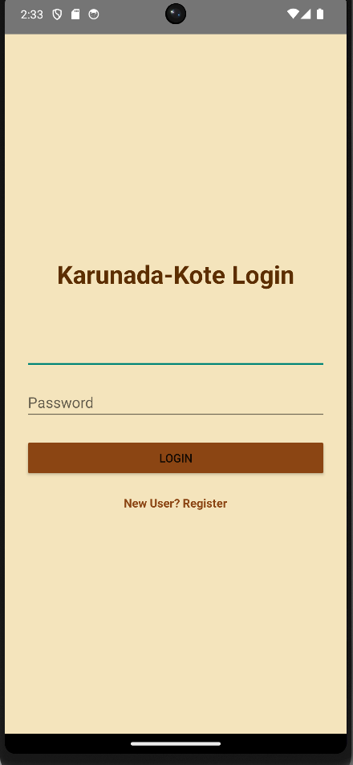
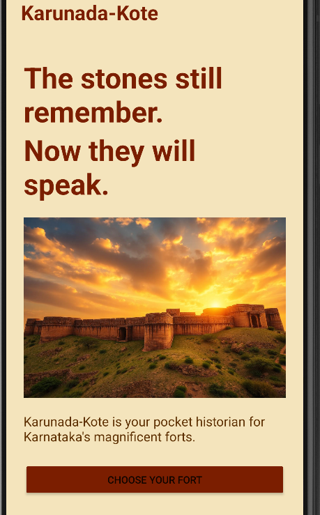
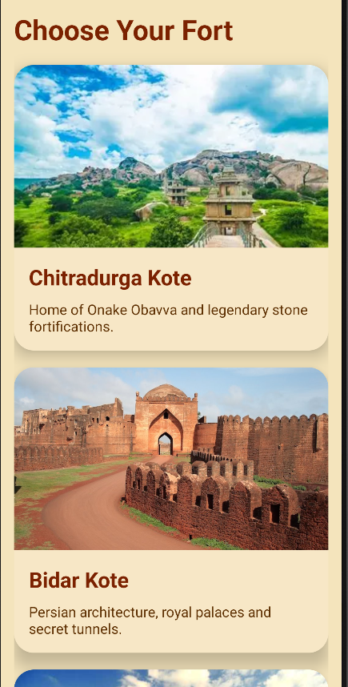
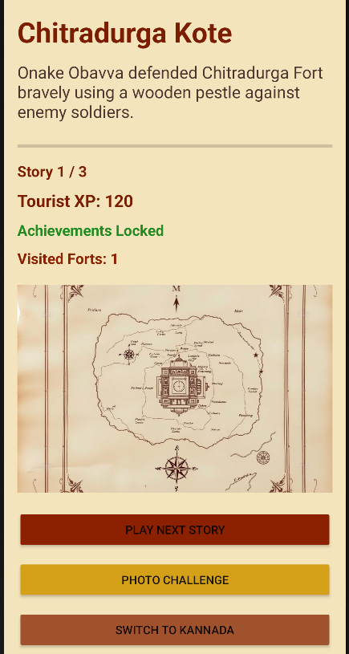
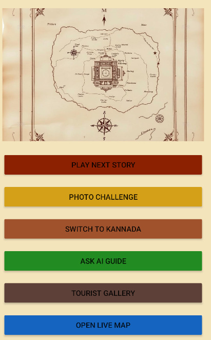
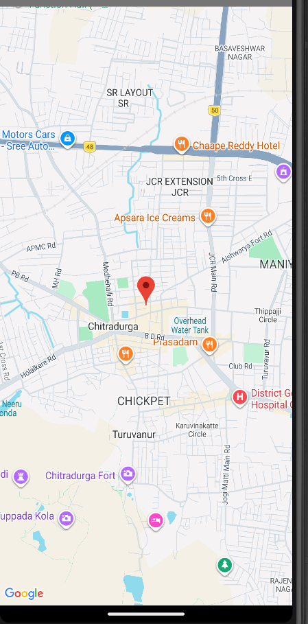

# Android App Development using GenAI — Karunada-Kote Guide (Karnataka Pride)

## 🏰 Overview

Karunada-Kote Guide is an AI-powered Karnataka Heritage Tourism Android Application designed to bring the history of Karnataka forts to life through interactive storytelling, bilingual narration, guided maps, tourist challenges, and heritage exploration.

The application acts as a **Virtual Historian** for tourists visiting famous Karnataka forts such as:

- Chitradurga Kote
- Bidar Kote
- Belagavi Kote

The app provides immersive historical storytelling, photo challenges, AI guidance, tourist achievement systems, and interactive fort exploration experiences.

---

# 📌 Problem Statement

Karnataka has magnificent forts with deep historical importance, but many tourists walk through them without understanding their engineering, military architecture, water systems, or heroic stories.

Professional tourist guides are often:
- Expensive
- Unavailable
- Limited to specific timings

Traditional signboards are faded and fail to create engaging experiences for students and young tourists.

---

# 💡 Project Vision

Karunada-Kote Guide transforms a smartphone into a **smart heritage companion**.

As users explore a fort, the application provides:
- Interactive fort maps
- Story narration
- Tourist progression systems
- AI historical guide support
- Photo challenges
- Heritage achievements

The app combines:
- Artificial Intelligence
- Storytelling
- Tourism
- Gamification
- Cultural preservation

to create an engaging educational tourism experience.

---

# 🚀 Features Implemented

## ✅ Premium Heritage UI
- Historic parchment design
- Royal Karnataka theme
- Heritage color palette
- Premium fort cards
- Smooth scroll interface

---

## ✅ Fort Selection System
Users can select and explore:
- Chitradurga Kote
- Bidar Kote
- Belagavi Kote

Each fort includes:
- Images
- Stories
- Historical details
- Tourist interactions

---

## ✅ Advanced Story Narration System
Each fort contains:
- Multiple historical stories
- Progressive story unlocking
- Story completion tracking
- XP-based tourist progression

Features:
- Story counter system
- Achievement unlocking
- Progress tracking
- Historical storytelling

---

## ✅ Kannada + English Language Toggle
The app supports:
- English narration
- Kannada narration

Tourists can dynamically switch languages while exploring forts.

---

## ✅ AI Heritage Guide
Integrated AI Guide system provides:
- Historical insights
- Military engineering explanations
- Heritage facts
- Defense architecture details

---

## ✅ Tourist XP & Achievement System
Gamified heritage tourism experience with:
- XP points
- Achievement badges
- Explorer badge
- Historian badge
- Tourist progression

---

## ✅ Interactive Fort Map
Features:
- Historic fort map overlays
- Landmark interaction
- Tourist point selection
- Guided exploration system

---

## ✅ Photo Challenge System
Tourists can:
- Capture fort memories
- Complete heritage challenges
- Save images permanently
- Build tourist memories

---

## ✅ Tourist Gallery
Gallery system includes:
- Saved fort images
- Tourist memories
- Captured moments
- Permanent image storage

---

## ✅ Audio Story Narration
Implemented using:
- TextToSpeech API
- Multi-story narration
- Kannada & English support

---

## ✅ Google Maps Integration
Features:
- GPS location support
- Tourist navigation system
- Landmark guidance
- Heritage location exploration

---

## ✅ Persistent Data Features
The app tracks:
- Tourist XP
- Completed stories
- Achievement progress
- Saved photos
- Visited forts

---

# 🛠️ Technologies Used

## Frontend
- XML
- Material Design UI

## Backend Logic
- Kotlin

## Android Features
- TextToSpeech
- Media APIs
- Camera API
- Google Maps API
- GPS Location Services
- File Storage APIs

## Development Tools
- Android Studio
- GitHub
- Gradle

---

# 🧠 AI + Tourism Concept

The project combines:
- Artificial Intelligence
- Smart tourism
- Interactive education
- Heritage preservation

to create a modern tourism solution for Karnataka forts.

---

# 📱 User Flow

## 1️⃣ Login/Register
User authentication system.

## 2️⃣ Home Screen
Historic UI introduction and app overview.

## 3️⃣ Fort Selection
Choose a Karnataka fort to explore.

## 4️⃣ Guided Exploration
Explore:
- Maps
- Stories
- Heritage landmarks

## 5️⃣ Story Narration
Listen to historical stories in:
- Kannada
- English

## 6️⃣ Photo Challenges
Complete tourism-based exploration tasks.

## 7️⃣ Tourist Achievements
Unlock:
- XP
- Badges
- Story progress

---

# 🎯 Impact Goals

## Heritage Tourism
Increase tourist engagement and exploration time.

## Educational Tourism
Make Karnataka history interactive and enjoyable for students.

## Karnataka Pride
Highlight ancient engineering brilliance, defense systems, and water management techniques.

---

# 🏆 Success Criteria Achieved

✅ Historic themed UI  
✅ Interactive storytelling  
✅ Kannada + English narration  
✅ Tourist progression system  
✅ AI guide system  
✅ Interactive map exploration  
✅ Photo challenge system  
✅ Permanent tourist gallery  
✅ GPS support  
✅ Google Maps integration  
✅ Achievement system  

---

# 📸 Application Screenshots

---

---

---

---

---

---

# 🔮 Future Enhancements

- Real beacon system
- Offline fort navigation
- AR heritage exploration
- Multiplayer tourist challenges
- Cloud tourist accounts
- AI chatbot historian
- Real-time fort crowd analytics

---

# 👨‍💻 Developed By

Shreesha

